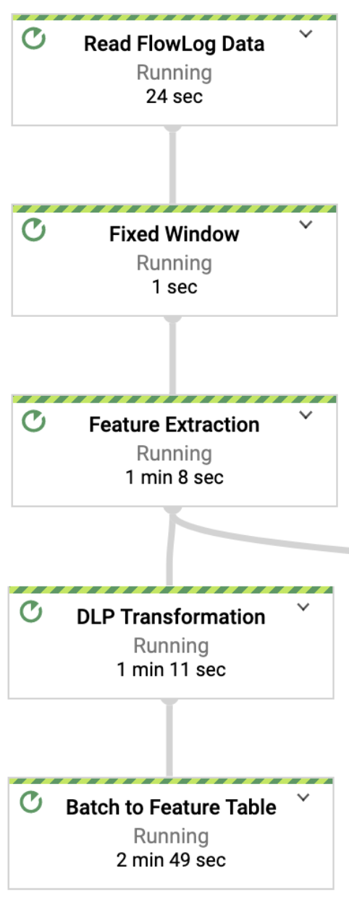
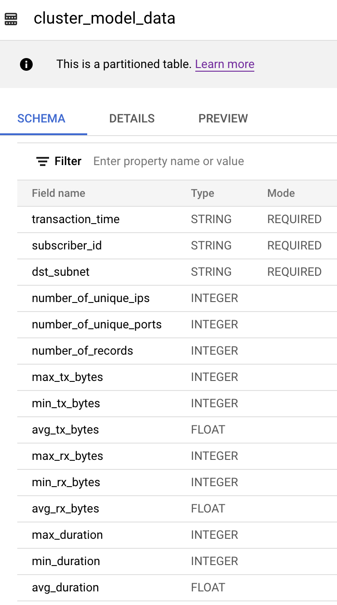
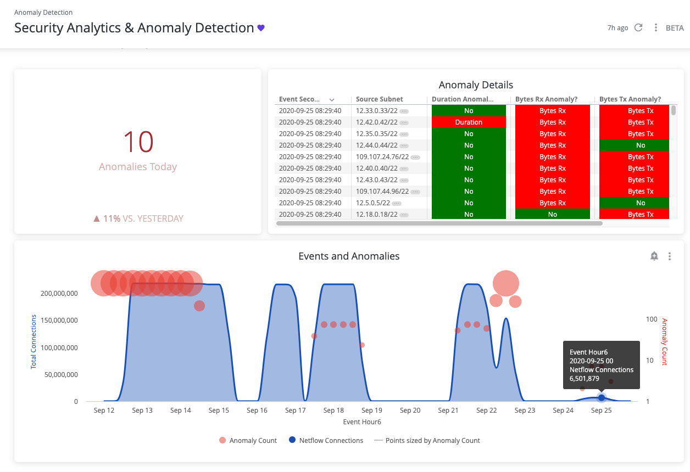
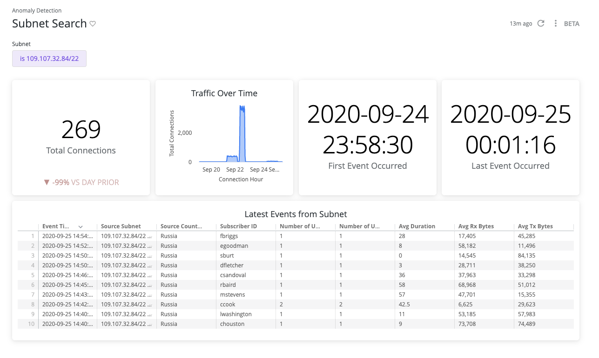

# Building a secure anomaly detection solution using Dataflow, BigQuery ML, and Cloud Data Loss Prevention
This tutorial shows you how to build a secure ML-based network anomaly detection solution for telecommunication networks. This type of solution is used to help identify cybersecurity threats.

This tutorial is intended for data engineers who intends to understand how to approach building and End to End Analytics Solution using Google Cloud Technologies from Data Ingestion (both Batch and Streaming) to Transformation (Aggregations, Feature Extraction, Tokenization using PII data de-identification), Realtime ML based Prediction with focus on Monitoring and Health management capabilities of the End to End Solution.

We also Intend to Demo the ML building capabilities of the BigQuery ML to data scientists and Visualization capabilities of Looker for the data analysts.    

## Demo Setup steps

  * [Automated Initial Setup](#automated-initial-setup) 
  * [Manual Initial Setup](#manual-initial-setup) 

## Demo Guide  
  * [Demo Reference Architecture](#demo-reference-architecture)
  * [Raw Data Ingestion](#raw-data-ingestion)     
  * [Data Transformation](#data-transformation) 
  * [Realtime outlier detection](#realtime-outlier-detection)   
  * [Pipeline Monitoring](#pipeline-monitoring)  
  * [Sensitive data (IMSI) de-identification using Cloud DLP](#dlp-integration) 
  * [Train & Normalize Data Using BQ ML](#create-a-k-means-model-using-bq-ml)
  * [Visualisation](#looker-integration). 
	

## Automated Initial Setup
(Try and Correct this Tomorrow)
1. Enable APIs

```
gcloud services enable storage_component
gcloud services enable dataflow
gcloud services enable cloudbuild.googleapis.com
gcloud config set project <project_id>
```

2. Access to Cloud Build Service Account

```
export PROJECT_NUMBER=$(gcloud projects list --filter=${PROJECT_ID} --format="value(PROJECT_NUMBER)") 
gcloud projects add-iam-policy-binding ${PROJECT_ID} --member serviceAccount:$PROJECT_NUMBER@cloudbuild.gserviceaccount.com --role roles/editor
gcloud projects add-iam-policy-binding ${PROJECT_ID} --member serviceAccount:$PROJECT_NUMBER@cloudbuild.gserviceaccount.com --role roles/storage.objectAdmin
```

3. Export Required Parameters

```
export DATASET=<var>bq-dataset-name</var>
export SUBSCRIPTION_ID=<var>subscription_id</var>
export TOPIC_ID=<var>topic_id</var>
export DATA_STORAGE_BUCKET=${PROJECT_ID}-<var>data-storage-bucket</var>
export DEID_TEMPLATE=projects/{id}/deidentifyTemplates/{template_id}
export BATCH_SIZE = 350000
```

Batch Size is in bytes and max allowed is less than 520KB/payload

4. Trigger Cloud Build Script

```
gcloud builds submit scripts/. --config scripts/cloud-build-demo.yaml  --substitutions \
_DATASET=$DATASET,\
_DATA_STORAGE_BUCKET=$DATA_STORAGE_BUCKET,\
_SUBSCRIPTION_ID=${SUBSCRIPTION_ID},\
_TOPIC_ID=${TOPIC_ID},\
_API_KEY=$(gcloud auth print-access-token)
```

## Manual Initial Setup 
(Optional)
1. In the Google Cloud Console, on the project selector page, select or create a Google Cloud project.

Note: If you don't plan to keep the resources that you create in this procedure, create a project instead of selecting an existing project. After you finish these steps, you can delete the project, removing all resources associated with the project.
[Go to project selector](https://console.cloud.google.com/projectselector2/home/dashboard)

2. Make sure that billing is enabled for your Cloud project. [Learn how to confirm that billing is enabled for your project.](https://cloud.google.com/billing/docs/how-to/modify-project)

3. In the Cloud Console, activate Cloud Shell [Activate Cloud Shell](https://console.cloud.google.com/?cloudshell=true)

At the bottom of the Cloud Console, a Cloud Shell session starts and displays a command-line prompt. Cloud Shell is a shell environment with the Cloud SDK already installed, including the gcloud command-line tool, and with values already set for your current project. It can take a few seconds for the session to initialize.

You run all commands in this guide from the Cloud Shell.

4. In Cloud Shell, enable the BigQuery, Dataflow, Cloud Storage, and DLP APIs.

```
gcloud services enable dlp.googleapis.com bigquery.googleapis.com \
  dataflow.googleapis.com storage-component.googleapis.com \
  pubsub.googleapis.com cloudbuild.googleapis.com
  ```

5. Run following commands to set the Config Variables in Cloud Shell:

```
export PROJECT_ID=$(gcloud config get-value project)
export TOPIC_ID=demo-anomaly-detect
export SUBSCRIPTION_ID=demo-anomaly-detect-sub
export REGION=us-central1
export PROJECT_NUMBER=$(gcloud projects list --filter=${PROJECT_ID} \
  --format="value(PROJECT_NUMBER)")
export DATASET_NAME=demoanalyticsds
export DF_TEMPLATE_CONFIG_BUCKET=${PROJECT_ID}-anomaly-config
export DLP_API_ROOT_URL="https://dlp.googleapis.com"
export DEID_TEMPLATE_API="${DLP_API_ROOT_URL}/v2/projects/${PROJECT_ID}/deidentifyTemplates"
export DEID_CONFIG="@deid_template.json"
export ACCESS_TOKEN=$(gcloud auth print-access-token) 
```

6. Run following commands in Cloud Shell to create a Pub/Sub topic and a subscription:

```
gcloud pubsub topics create $TOPIC_ID
gcloud pubsub subscriptions create $SUBSCRIPTION_ID --topic=$TOPIC_ID 
```

7. Run following commands in Cloud Shell to clone the GitHub repository:

```
git clone https://github.com/GoogleCloudPlatform/df-ml-anomaly-detection.git
cd df-ml-anomaly-detection
```

8. For Cloud Build To enable submitting a job automatically, grant Dataflow permissions to your Cloud Build service account:

```
gcloud projects add-iam-policy-binding ${PROJECT_ID} \
  --member serviceAccount:${PROJECT_NUMBER}@cloudbuild.gserviceaccount.com \
  --role roles/dataflow.admin

gcloud projects add-iam-policy-binding ${PROJECT_ID} \
  --member serviceAccount:${PROJECT_NUMBER}@cloudbuild.gserviceaccount.com \
  --role roles/compute.instanceAdmin.v1

gcloud projects add-iam-policy-binding ${PROJECT_ID} \
  --member serviceAccount:${PROJECT_NUMBER}@cloudbuild.gserviceaccount.com \
  --role roles/iam.serviceAccountUser
```

9. Use Cloud Build to Start the source data generation :

```
gcloud builds submit . --machine-type=n1-highcpu-8 \
  --config scripts/cloud-build-data-generator.yaml \
  --substitutions _TOPIC_ID=${TOPIC_ID}
```

10. Validate that the log data is published in the subscription:

```
gcloud pubsub subscriptions pull ${SUBSCRIPTION_ID} --auto-ack --limit 1 >> raw_log.txt
cat raw_log.txt
```
The output contains a subset of NetFlow log schema fields populated with random values, similar to the following:

```
{
 \"subscriberId\": \"mharper\",
 \"srcIP\": \"12.0.9.4",
 \"dstIP\": \"12.0.1.2\",
 \"srcPort\": 5000,
 \"dstPort\": 3000,
 \"txBytes\": 15,
 \"rxBytes\": 40,
 \"startTime\": 1570276550,
 \"endTime\": 1570276559,
 \"tcpFlag\": 0,
 \"protocolName\": \"tcp\",
 \"protocolNumber\": 0
} 
```

11. In Cloud Shell, create a BigQuery dataset and necessary Tables

```
bq --location=US mk -d \
  --description "Network Logs Dataset" \
  ${DATASET_NAME}

bq mk -t --schema src/main/resources/netflow_log_raw_data.json \
  --time_partitioning_type=DAY \
  --clustering_fields="geoCountry,geoCity" \
  --description "Raw Netflow Log Data" \
  ${PROJECT_ID}:${DATASET_NAME}.netflow_log_data

bq mk -t --schema src/main/resources/aggr_log_table_schema.json \
  --time_partitioning_type=DAY \
  --clustering_fields="dst_subnet,subscriber_id" \
  --description "Network Log Feature Table" \
  ${PROJECT_ID}:${DATASET_NAME}.cluster_model_data

bq mk -t --schema src/main/resources/outlier_table_schema.json \
  --description "Network Log Outlier Table" \
  ${PROJECT_ID}:${DATASET_NAME}.outlier_data

bq mk -t --schema src/main/resources/normalized_centroid_data_schema.json \
  --description "Sample Normalized Data" \
  ${PROJECT_ID}:${DATASET_NAME}.normalized_centroid_data
```
The following tables are generated:

netflow_log_data: a clustered partition table that stores the raw netflow log data as ingested from source. 

cluster_model_data: a clustered partition table that stores feature values for model creation. 

outlier_data: an outlier table that stores anomalies. 

normalized_centroid_data: a table pre-populated with normalized data created from a sample model. 

12. Load the Centroid Sample data into Centroid Table

```
bq load \
  --source_format=NEWLINE_DELIMITED_JSON \
  ${PROJECT_ID}:${DATASET_NAME}.normalized_centroid_data \
  gs://df-ml-anomaly-detection-mock-data/sample_model/normalized_centroid_data.json src/main/resources/normalized_centroid_data_schema.json
```

13. In Cloud Shell, create a Docker image in your project:

```
gcloud auth configure-docker
gradle jib --image=gcr.io/${PROJECT_ID}/df-ml-anomaly-detection:latest -DmainClass=com.google.solutions.df.log.aggregations.SecureLogAggregationPipeline
```

14. Upload the Flex Template configuration file to the Cloud Storage bucket that you created earlier:

```
gsutil mb -c standard -l ${REGION} gs://${DF_TEMPLATE_CONFIG_BUCKET}
cat << EOF | gsutil cp - gs://${DF_TEMPLATE_CONFIG_BUCKET}/dynamic_template_secure_log_aggr_template.json
{"image": "gcr.io/${PROJECT_ID}/df-ml-anomaly-detection",
"sdk_info": {"language": "JAVA"}
}
EOF
```

15. Create a SQL file to pass the normalized model data as a pipeline parameter:

```
echo "SELECT * FROM \`${PROJECT_ID}.${DATASET_NAME}.normalized_centroid_data\`" > normalized_cluster_data.sql
gsutil cp normalized_cluster_data.sql gs://${DF_TEMPLATE_CONFIG_BUCKET}/
```

16. Create the end to end anomaly detection pipeline:

```
gcloud beta dataflow flex-template run "anomaly-detection" \
--project=${PROJECT_ID} \
--region=${REGION} \
--template-file-gcs-location=gs://${DF_TEMPLATE_CONFIG_BUCKET}/dynamic_template_secure_log_aggr_template.json \
--parameters=autoscalingAlgorithm="NONE",\
numWorkers=5,\
maxNumWorkers=5,\
workerMachineType=n1-highmem-4,\
subscriberId=projects/${PROJECT_ID}/subscriptions/${SUBSCRIPTION_ID},\
tableSpec=${PROJECT_ID}:${DATASET_NAME}.cluster_model_data,\
batchFrequency=2,\
customGcsTempLocation=gs://${DF_TEMPLATE_CONFIG_BUCKET}/temp,\
tempLocation=gs://${DF_TEMPLATE_CONFIG_BUCKET}/temp,\
clusterQuery=gs://${DF_TEMPLATE_CONFIG_BUCKET}/normalized_cluster_data.sql,\
outlierTableSpec=${PROJECT_ID}:${DATASET_NAME}.outlier_data,\
inputFilePattern=gs://df-ml-anomaly-detection-mock-data/flow_log*.json,\
workerDiskType=compute.googleapis.com/projects/${PROJECT_ID}/zones/us-central1-b/diskTypes/pd-ssd,\
diskSizeGb=5,\
windowInterval=10,\
writeMethod=FILE_LOADS,\
streaming=true,\
logTableSpec=${PROJECT_ID}:${DATASET_NAME}.netflow_log_data
```

17. In Cloud Shell, create a crypto key:

```
export TEK=$(openssl rand -base64 32); 
echo ${TEK}
```

18. Replace the CRYPTO_KEY text below with the TEK value generated above and put it in the deid_template.json file in CLoud Shell.

```
{
  "deidentifyTemplate": {
    "displayName": "Config to de-identify IMEI Number",
    "description": "IMEI Number masking transformation",
    "deidentifyConfig": {
      "recordTransformations": {
        "fieldTransformations": [
          {
            "fields": [
              {
                "name": "subscriber_id"
              }
            ],
            "primitiveTransformation": {
              "cryptoDeterministicConfig": {
                "cryptoKey": {
                  "unwrapped": {
                    "key": "CRYPTO_KEY"
                  }
                },
                "surrogateInfoType": {
                  "name": "IMSI_TOKEN"
                }
              }
            }
          }
        ]
      }
    }
  },
  "templateId": "dlp-deid-subid"
}
```

19. In the Cloud Shell terminal, create a Cloud DLP de-identify template:

```
curl -X POST -H "Content-Type: application/json" \
   -H "Authorization: Bearer ${ACCESS_TOKEN}" \
   "${DEID_TEMPLATE_API}" \
   -d "${DEID_CONFIG}"
```
This creates a template with the following name in your Cloud project:

```
"name": "projects/${PROJECT_ID}/deidentifyTemplates/dlp-deid-sub-id"
```

20. In the Cloud Console, go to the Dataflow page.

Click the `netflow-anomaly-detection` job. A representation of the Dataflow pipeline that's similar to the following appears:


## Demo Reference Architecture


## Raw Data Ingestion

1. Discuss and Explain the Raw Data Ingestion part of the Pipeline
2. Publish a message to the Topic
```
gcloud pubsub topics publish ${TOPIC_ID} --message \
"{\"subscriberId\": \"00123456789\",  \
\"srcIP\": \"12.0.1.1\", \
\"dstIP\": \"12.0.1.3\", \
\"srcPort\": 5000, \
\"dstPort\": 3000, \
\"txBytes\": 300, \
\"rxBytes\": 400, \
\"startTime\": 1570276550, \
\"endTime\": 1570276550, \
\"tcpFlag\": 0, \
\"protocolName\": \"tcp\", \
\"protocolNumber\": 0}"
```

2. After a minute or so, validate that the Raw message is pushed to the topic and stored in the BigQuery table:

```
export RAW_TABLE_QUERY='SELECT subscriberid,srcIP,startTime
FROM `'${PROJECT_ID}.${DATASET_NAME}'.netflow_log_data`
WHERE subscriberid like "00123%"'

bq query --nouse_legacy_sql $RAW_TABLE_QUERY >> raw_orig.txt
cat raw_orig.txt
```

The output is similar to the following:

```
+---------------+--------------+----------------------------+
| subscriberid |  srcIP       |   startTime.           |
+---------------+--------------+----------------------------+
| 00123456789   | 12.0.1.1.    | 1570276550             |
+---------------+--------------+----------------------------+
```

## Data Transformation

1. Discuss and Explain the Data Transformation Part of the Pipeline as below



2. Why is Transforamtion Important? Because we need to Transform the Source Data format to Target Data Format which is required for our Anomaly Detection ML model creation





## Realtime outlier detection
1. Discuss and Explain the Outlier detection part of the pipeline


2. In Cloud Shell, publish the following message

```
gcloud pubsub topics publish ${TOPIC_ID} --message \
"{\"subscriberId\": \"00000000000000000\",  \
\"srcIP\": \"12.0.9.4\", \
\"dstIP\": \"12.0.1.3\", \
\"srcPort\": 5000, \
\"dstPort\": 3000, \
\"txBytes\": 150000, \
\"rxBytes\": 40000, \
\"startTime\": 1570276550, \
\"endTime\": 1570276550, \
\"tcpFlag\": 0, \
\"protocolName\": \"tcp\", \
\"protocolNumber\": 0}"
```
Notice the unusually high number of transmission (txBytes) and receiving bytes (rxBytes) compared to the range (100 to 500 bytes) set up for synthetic data. This message might indicate a security risk to validate

3. After a minute or so, validate that the anomaly is identified and stored in the BigQuery table:

```
export OUTLIER_TABLE_QUERY='SELECT subscriber_id,dst_subnet,transaction_time
FROM `'${PROJECT_ID}.${DATASET_NAME}'.outlier_data`
WHERE subscriber_id like "0%" limit 1'
bq query --nouse_legacy_sql $OUTLIER_TABLE_QUERY >> outlier_orig.txt
cat outlier_orig.txt
```
The output is similar to the following:

```
+---------------+--------------+----------------------------+
| subscriber_id |  dst_subnet  |   transaction_time |
+---------------+--------------+----------------------------+
| 00000000000| 12.0.1.3/22 | 2020-07-09 21:29:36.571000 |
+---------------+--------------+----------------------------+
```

## Pipeline Monitoring

1. Open The Pub/Sub subscriptions and Dataflow Pipeline in GCP console and check the different Matrices monitoring the pipeline


## DLP Integration
In this section, we reuse the pipeline by passing an additional parameter to de-identify the international mobile subscriber identity (IMSI) number in the subscriber_id column.

1. Stop the pipeline that you triggered in an earlier step:

```
gcloud dataflow jobs list --filter="name=anomaly-detection" --status=active
```

2. Trigger the anomaly detection pipeline using the Cloud DLP de-identify the template name:

```
gcloud beta dataflow flex-template run "anomaly-detection-with-dlp" \
--project=${PROJECT_ID} \
--region=us-central1 \
--template-file-gcs-location=gs://${DF_TEMPLATE_CONFIG_BUCKET}/dynamic_template_secure_log_aggr_template.json \
--parameters=autoscalingAlgorithm="NONE",\
numWorkers=5,\
maxNumWorkers=5,\
workerMachineType=n1-highmem-4,\
subscriberId=projects/${PROJECT_ID}/subscriptions/${SUBSCRIPTION_ID},\
tableSpec=${PROJECT_ID}:${DATASET_NAME}.cluster_model_data,\
batchFrequency=2,\
customGcsTempLocation=gs://${DF_TEMPLATE_CONFIG_BUCKET}/temp,\
tempLocation=gs://${DF_TEMPLATE_CONFIG_BUCKET}/temp,\
clusterQuery=gs://${DF_TEMPLATE_CONFIG_BUCKET}/normalized_cluster_data.sql,\
outlierTableSpec=${PROJECT_ID}:${DATASET_NAME}.outlier_data,\
inputFilePattern=gs://df-ml-anomaly-detection-mock-data/flow_log*.json,\
workerDiskType=compute.googleapis.com/projects/${PROJECT_ID}/zones/us-central1-b/diskTypes/pd-ssd,\
diskSizeGb=5,\
windowInterval=10,\
writeMethod=FILE_LOADS,\
streaming=true,\
deidTemplateName=projects/${PROJECT_ID}/deidentifyTemplates/dlp-deid-subid
```

This Pipeline setup may take some time. Until then discuss and explain #16-18 in the Setup process around the DLP Template generation that we are using in this pipeline setup. This template is also shown in the Security-Data Loss Prevention GCP Console as well.

3. In Cloud Shell, publish the following message

```
gcloud pubsub topics publish ${TOPIC_ID} --message \
"{\"subscriberId\": \"00000000000000000\",  \
\"srcIP\": \"12.0.9.4\", \
\"dstIP\": \"12.0.1.3\", \
\"srcPort\": 5000, \
\"dstPort\": 3000, \
\"txBytes\": 150000, \
\"rxBytes\": 40000, \
\"startTime\": 1570276550, \
\"endTime\": 1570276550, \
\"tcpFlag\": 0, \
\"protocolName\": \"tcp\", \
\"protocolNumber\": 0}"
```

4. Query the outlier table to validate that the subscriber ID is successfully de-identified:

```
export DLP_OUTLIER_TABLE_QUERY='SELECT subscriber_id,dst_subnet,transaction_time
FROM `'${PROJECT_ID}.${DATASET_NAME}'.outlier_data`
ORDER BY transaction_time DESC'

bq query --nouse_legacy_sql $DLP_OUTLIER_TABLE_QUERY >> outlier_deid.txt

cat outlier_deid.txt
```

5. The output is similar to the following:

```
+---------------+--------------+----------------------------+
| subscriber_id |  dst_subnet  |      transaction_time      |
+---------------+--------------+----------------------------+
| IMSI_TOKEN(64):AcZD2U2v//QiKkGzbFCm29pv5cqVi3Db09Z6CNt5cQSevBKRQvgdDfacPQIRY1dc| 12.0.1.3/22 | 2020-07-09 21:29:36.571000 |
+---------------+--------------+----------------------------+
```

If the subscriber ID was de-identified, the subscriber_id column is no longer the original subscriber ID, which was 00000000000

## Create a K-means model using bq ml

1. In the Cloud Console, go to the BigQuery Query editor page.

[Go to Query editor](https://console.cloud.google.com/bigquery)

2. Select training data from the feature table and create a k-means clustering model using BigQuery ML:

```
--> temp table for training data
#standardSQL
CREATE OR REPLACE TABLE DATASET_ID.train_data as
(SELECT * FROM DATASET_ID.cluster_model_data
WHERE _PARTITIONDATE BETWEEN START_DATE AND END_DATE
AND NOT IS_NAN(avg_tx_bytes)
AND NOT IS_NAN(avg_rx_bytes)
AND NOT IS_NAN(avg_duration))
limit 100000;

--> create a model using BigQuery ML
#standardSQL
CREATE OR REPLACE MODEL DATASET_ID.log_cluster options(model_type='kmeans', standardize_features = true) AS
SELECT * EXCEPT (transaction_time,subscriber_id,number_of_unique_ips, number_of_unique_ports, dst_subnet)
FROM DATASET_ID.train_data;
```
Replace the following:

START_DATE and END_DATE: the current date ('yyyy-mm-dd' format)
DATASET_ID: your created dataset ID

3. Normalize the data for each cluster:

```
--> create normalize table for each centroid
#standardSQL
CREATE OR REPLACE TABLE DATASET_ID.normalized_centroid_data as(
with centroid_details AS (
SELECT centroid_id,array_agg(struct(feature as name, round(numerical_value,1) as value)
order by centroid_id) AS cluster
from ML.CENTROIDS(model DATASET_ID.log_cluster)
group by centroid_id
),
cluster as (select centroid_details.centroid_id as centroid_id,
(select value from unnest(cluster) where name = 'number_of_records') AS number_of_records,
(select value from unnest(cluster) where name = 'max_tx_bytes') AS max_tx_bytes,
(select value from unnest(cluster) where name = 'min_tx_bytes') AS min_tx_bytes,
(select value from unnest(cluster) where name = 'avg_tx_bytes') AS avg_tx_bytes,
(select value from unnest(cluster) where name = 'max_rx_bytes') AS max_rx_bytes,
(select value from unnest(cluster) where name = 'min_rx_bytes') AS min_rx_bytes,
(select value from unnest(cluster) where name = 'avg_rx_bytes') AS avg_rx_bytes,
(select value from unnest(cluster) where name = 'max_duration') AS max_duration,
(select value from unnest(cluster) where name = 'min_duration') AS min_duration,
(select value from unnest(cluster) where name = 'avg_duration') AS avg_duration
FROM centroid_details order by centroid_id asc),
predict as
(select * from ML.PREDICT(model DATASET_ID.log_cluster,
(select * from DATASET_ID.train_data)))
select c.centroid_id as centroid_id,
(stddev((p.number_of_records-c.number_of_records)+(p.max_tx_bytes-c.max_tx_bytes)+(p.min_tx_bytes-c.min_tx_bytes)+(p.avg_tx_bytes-c.min_tx_bytes)+(p.max_rx_bytes-c.max_rx_bytes)+(p.min_rx_bytes-c.min_rx_bytes)+      (p.avg_rx_bytes-c.min_rx_bytes)
+(p.max_duration-c.max_duration)+(p.min_duration-c.min_duration)+(p.avg_duration-c.avg_duration)))
as normalized_dest, any_value(c.number_of_records) as number_of_records,any_value(c.max_tx_bytes) as max_tx_bytes,  any_value(c.min_tx_bytes) as min_tx_bytes , any_value(c.avg_tx_bytes) as   avg_tx_bytes,any_value(c.max_rx_bytes) as max_rx_bytes,   any_value(c.min_tx_bytes) as min_rx_bytes ,any_value(c.avg_rx_bytes) as avg_rx_bytes,  any_value(c.avg_duration) as avg_duration,any_value(c.max_duration)
as max_duration , any_value(c.min_duration) as min_duration
from predict as p
inner join cluster as c on c.centroid_id = p.centroid_id
group by c.centroid_id);
```

This query calculates a normalized distance for each cluster by using the standard deviation function between the input and centroid vectors. In other words, it implements the following formula:

stddev(input_value_x-centroid_value_x)+(input_value_y-centroid_value_y)+(..))

4. Validate the normalized_centroid_data table: Replace DATASET_ID with the ID of your created dataset.

```
#standardSQL
SELECT * from DATASET_ID.normalized_centroid_data
```

The result from this statement is a table of calculated normalized distances for each centroid ID:

5. Normalized data for each k-means cluster.


## Looker Integration


